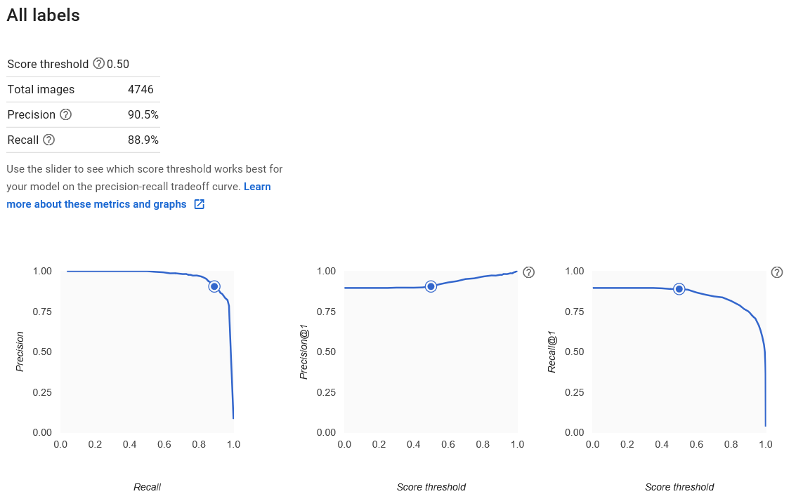
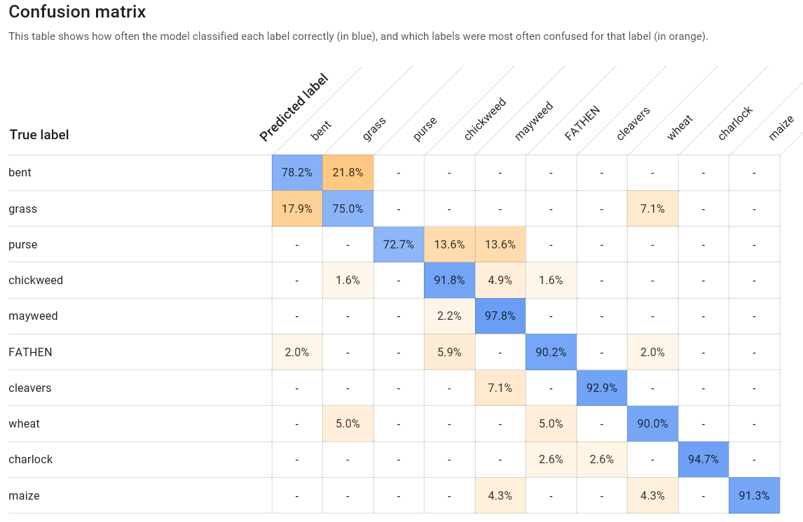
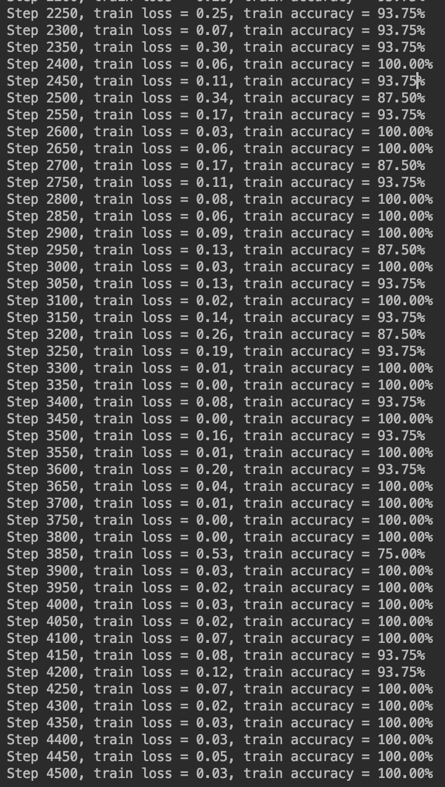
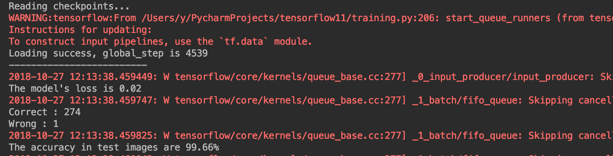
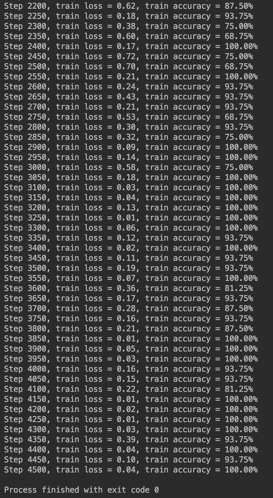
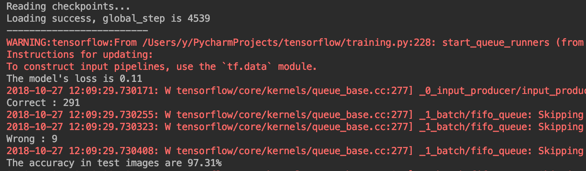

# Seedlings
Computer vision project to determine plant type

The idea of the whole project is to classify 12 kinds of seedlings as accurate as we can. However, there is two kinds of plants are very similar: Black_grass and Loose Silky_Bent, and by using the AutoML as a benchmarking, we can also find that it is a little hard to detect them even using AutoMl.

So, after discussion, we decided to use two different models to detect all 12 labels. First we combine the Black_grass and Loose Silky_Bent dataset together as a Black_Bent label, and train all images with a simple model, say a 7_layers one. And use another complex model, for instance, vgg19, to classify Black_grass and Loose Silky_Bent. After the first training, we can have a good accuracy and then seperate the image of Black_Bent out, use the complex model to classify them.

Here is our result of first model (7 layers) with 11 labels.

Here is our result of first model (7 layers) with 12 labels.

As we can see, the 11_label_model's lose is much lower than the 12_label_model's.

Next step, we're gonna to build a vgg19 model to classify the Black_grass and Loose Silky_Bent. 

############################# This is Update line #########################

Actually, we r confused by the result that working with a 7-layer-model we can get such a good result, and then we checked again, fingding that we used images in training set to test, and after we retrained and use some totally new images to test, the accuracy decrease to about 68%, which cannot meet our request. And we used Vgg19 to train and test, the result is good, bigger than 90%. We'll update the model in a few days.
